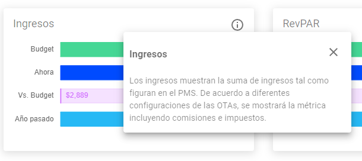

# PopupInfoCharts

Este componente tiene la finalidad de mostrar un ícono de información en forma de botón, que al hacer clic en él, abre un modal o un popover con información adicional, es altamente personalizable, ya que se puede especificar el título y el texto de información que se mostrarán.
El componente InfoPopover utiliza la biblioteca Material-UI para renderizar el ícono de información, el botón y los elementos modales o popovers. La elección entre el modal y el popover se determina en función del tamaño de la pantalla y se adapta para brindar la mejor experiencia al usuario.

:::info

**`PopupInfoCharts`** puede ser importado dentro de cualquier componente que necesite incorporar información adicional para mejorar la experiencia del usuario a la hora de interactuar con los elementos de Budget.
(como por ejemplo en `RoiBarChart.tsx` y `CountryDataTable.tsx`)

:::

